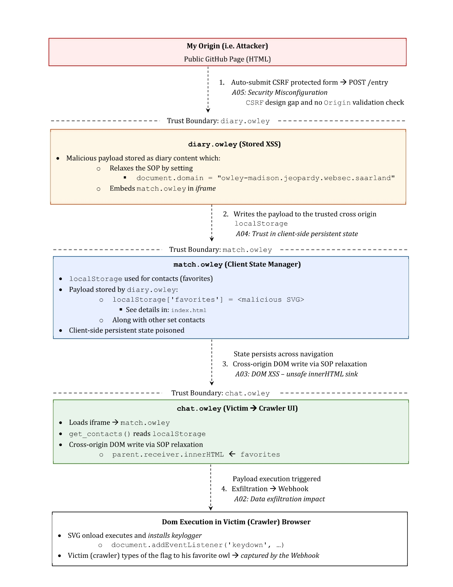

# Multi Stage Cross-Subdomain Stored DOM-XSS Exploitation via SOP Relaxation and Client-Side State Poisoning

- Successfully solved a [chain CTF challenge](https://owley-madison.jeopardy.websec.saarland/) involving Same-Origin Policy relaxation, localStorage exploitation, and stored XSS which are key areas of current browser security research.

- This challenge reinforced my interest in exploring persistent XSS vulnerabilities, granular SOP enforcement, and secure alternatives to client-side storage, all of which align closely with current research directions. 

- A visual representation of this CTF challenge can be found at the end of this page.

## Visual Representation

